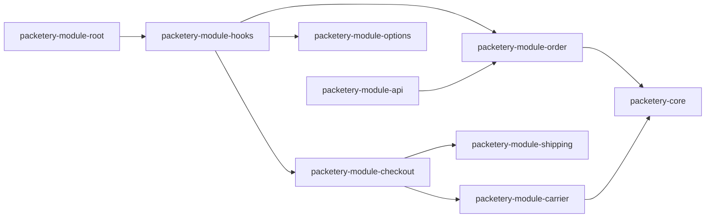

Repo: woocommerce · Module: — · Type: architecture · Status: current

## woocommerce: module composition

woocommerce is built as one WordPress plugin with a domain module and a set of integration modules
[VERIFY: src/Packetery/Module/Plugin.php#run]. The domain module holds the Packeta contract and no
WordPress code. Every other module speaks to WordPress and to WooCommerce, and one module registers
all the callbacks [VERIFY: src/Packetery/Module/Hooks/HookRegistrar.php#addMenuPages].

Textual description of the links of the diagram:

references → packetery-module-hooks
references → packetery-module-checkout
references → packetery-module-order
references → packetery-module-carrier
references → packetery-module-shipping
references → packetery-module-api
references → packetery-core

The plugin class starts `packetery-module-hooks`, which registers the callbacks of every module for
the current request [VERIFY: src/Packetery/Module/Plugin.php#run]. `packetery-module-shipping` gives
WooCommerce one method for each carrier, and that method asks `packetery-module-checkout` for the
price [VERIFY: src/Packetery/Module/Shipping/BaseShippingMethod.php#calculate_shipping].
`packetery-module-order` and `packetery-module-carrier` call the API clients of `packetery-core`
[VERIFY: src/Packetery/Module/Order/PacketSubmitter.php#submitPacket]. `packetery-module-api` writes
the data of the browser into the storage of the checkout and into the order
[VERIFY: src/Packetery/Module/Api/Internal/OrderController.php#saveModal].

## woocommerce: runtime flow of an order

woocommerce takes an order from the cart to Packeta in these steps:

1. WooCommerce asks the shipping method of each carrier for a rate, and the method asks the checkout
   module [VERIFY: src/Packetery/Module/Shipping/BaseShippingMethod.php#calculate_shipping]
2. The checkout module hides the carriers that cannot deliver the cart, and it computes the price of
   the others [VERIFY: src/Packetery/Module/Checkout/ShippingRateFactory.php#canCreateShippingRate]
3. The customer opens the Packeta widget, and the browser saves the selection through the internal
   REST routes [VERIFY: src/Packetery/Module/Api/Internal/CheckoutController.php#saveSelectedPickupPoint]
4. The checkout validates the selection before WooCommerce creates the order
   [VERIFY: src/Packetery/Module/Checkout/CheckoutValidator.php#actionValidateCheckoutData]
5. The order module writes the pickup point, the address and the carrier to its own table
   [VERIFY: src/Packetery/Module/Checkout/OrderUpdater.php#actionUpdateOrder]
6. The administrator submits the packet, or the automatic submission does it on an order state
   [VERIFY: src/Packetery/Module/Order/PacketAutoSubmitter.php#handleEvent]
7. A scheduled job reads the packet status back and can change the order status
   [VERIFY: src/Packetery/Module/Order/PacketSynchronizer.php#syncStatuses]

The flow assumes that the carrier list is current, because a carrier that no feed contains is marked
as deleted and stops appearing [VERIFY: src/Packetery/Module/Carrier/Repository.php#set_as_deleted].
A failure of the Packeta API stops the step and writes the fault to the order and to the log
[VERIFY: src/Packetery/Module/Order/PacketSubmitter.php#submitPacket].

## woocommerce: authentication and authorisation

woocommerce authenticates the shop against Packeta with the API password of the account, and it
derives the API key from that password
[VERIFY: src/Packetery/Module/Options/Page.php#sanitizePacketeryOptions]. Inside WordPress the
plugin relies on the capabilities of WordPress and on the nonce of a form.

| Boundary | Mechanism | Where | Anchor |
|---|---|---|---|
| Admin pages | Capability `manage_options` | `src/Packetery/Module/Options/Page.php` | [VERIFY: src/Packetery/Module/Options/Page.php#registerMenuPage] |
| Packet actions | Nonce of the action and the order number | `src/Packetery/Module/Order/PacketActionsCommonLogic.php` | [VERIFY: src/Packetery/Module/Order/PacketActionsCommonLogic.php#checkAction] |
| Order REST routes | Capability `edit_posts`, no nonce | `src/Packetery/Module/Api/Internal/OrderController.php` | [VERIFY: src/Packetery/Module/Api/Internal/OrderController.php#registerRoutes] |
| Checkout REST routes | None, the permission callback always returns true | `src/Packetery/Module/Api/Internal/CheckoutController.php` | [VERIFY: src/Packetery/Module/Api/Internal/CheckoutController.php#registerRoutes] |
| Packeta API | API password and API key of the shop | `src/Packetery/Core/Api/Soap/Client.php` | [VERIFY: src/Packetery/Core/Api/Soap/Client.php#setApiPassword] |

## woocommerce: data and persistence

woocommerce stores its data in five tables of the WordPress database and in the options of
WordPress [VERIFY: src/Packetery/Module/Upgrade.php#runCreateTables]. Each table belongs to the
module that reads it, and the repository of that module creates it
[VERIFY: src/Packetery/Module/Order/Repository.php#createOrAlterTable].

| Entity | Table or option | Owner | Anchor |
|---|---|---|---|
| order | Packeta row of a WooCommerce order | packetery-module-order | [VERIFY: src/Packetery/Module/Order/Repository.php#createOrAlterTable] |
| carrier | Carriers of the feed | packetery-module-carrier | [VERIFY: src/Packetery/Module/Carrier/Repository.php#createOrAlterTable] |
| customs declaration | Declaration of an order and its items | packetery-module-customsdeclaration | [VERIFY: src/Packetery/Module/CustomsDeclaration/Repository.php#Repository] |
| log | Result of every API call | packetery-module-log | [VERIFY: src/Packetery/Module/Log/Repository.php#createTable] |
| settings | Five options of the plugin | packetery-module-options | [VERIFY: src/Packetery/Module/Options/OptionNames.php#PACKETERY] |
| checkout-data | Transient of the selection of one customer | packetery-module-checkout | [VERIFY: src/Packetery/Module/Checkout/CheckoutStorage.php#setTransient] |

The upgrade owns the schema of every table, and it runs the migrations between plugin versions
[VERIFY: src/Packetery/Module/Upgrade.php#check]. The uninstall drops the tables only when the shop
permits it [VERIFY: src/Packetery/Module/Uninstaller.php#cleanUp].

## woocommerce: cross-cutting mechanisms

woocommerce applies these mechanisms across its modules.

| Mechanism | Scope | Anchor |
|---|---|---|
| Scheduled jobs | Carrier feed, packet status, log deletion and transient purge, all through the Action Scheduler | [VERIFY: src/Packetery/Module/CronService.php#deactivate] |
| Logging | Every API result and every carrier change | [VERIFY: src/Packetery/Module/Log/DbLogger.php#DbLogger] |
| Platform adapters | Every call of a WordPress or WooCommerce function | [VERIFY: src/Packetery/Module/Framework/WpAdapter.php#WpAdapter] |
| Order storage modes | The classic storage and the High Performance Order Storage | [VERIFY: src/Packetery/Module/ModuleHelper.php#isHposEnabled] |
| Flash messages | The result of an admin action | [VERIFY: src/Packetery/Module/MessageManager.php#flash_message] |

The plugin dispatches no in-process event of its own. It uses the hooks of WordPress instead, and
the filters that it gives to other plugins are listed in the reference page of each module
[VERIFY: src/Packetery/Module/Checkout/RateCalculator.php#getShippingRateCost].
