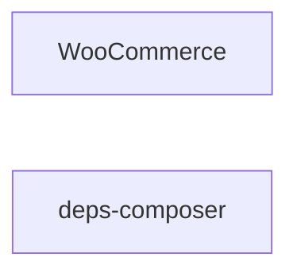

# woocommerce — AST map

Machine-generated by `tool:ast-map@0.3.1`. Do not edit by hand.

## Projects

| Project | Path | Files | Lines | Types | Public methods | References |
| --- | --- | --- | --- | --- | --- | --- |
| WooCommerce | `.` | 464 | 32299 | 455 | 1701 | — |
| deps-composer | `deps-composer` | 0 | 0 | 0 | 0 | — |

## Project dependency graph

### Edges (textual description)

- **WooCommerce** references no other project in the repository.
- **deps-composer** references no other project in the repository.

## Symbol counts

| Metric | Count |
| --- | --- |
| Projects | 2 |
| Source files (C#, PHP) | 464 |
| Types (classes, interfaces, traits, enums) | 455 |
| Public methods | 1701 |
| Calls (invocations) | 10729 |
